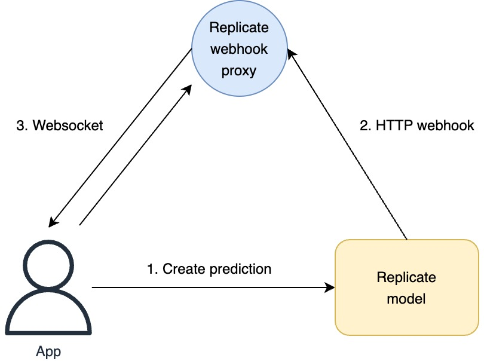

# Replicate Webhook Proxy - AWS Infra

A proxy in the middle will receive HTTP webhooks from a running Replicate model and relay them via Websockets to the client application.

### [Client: replicate-webhook-proxy](https://github.com/Pwntus/replicate-webhook-proxy)



## How to deploy

Install [Serverless Framework](https://www.serverless.com/) and create an [AWS account](https://aws.amazon.com/). Setup a new profile in `~/.aws/credentials` for a service role with administrative access. Change the `profile` in [services/ws/serverless.yml](./services/ws/serverless.yml) and [services/webhook/serverless.yml](./services/webhook/serverless.yml) to match the profile name in `~/.aws/credentials`.

1. Install dependencies:

```sh
npm install
```

2. Deploy the `ws` CloudFormation stack:

```sh
cd services/ws
sls deploy --stage prod
```

3. Deploy the `webhook` CloudFormation stack:

```sh
cd services/webhook
sls deploy --stage prod
```
